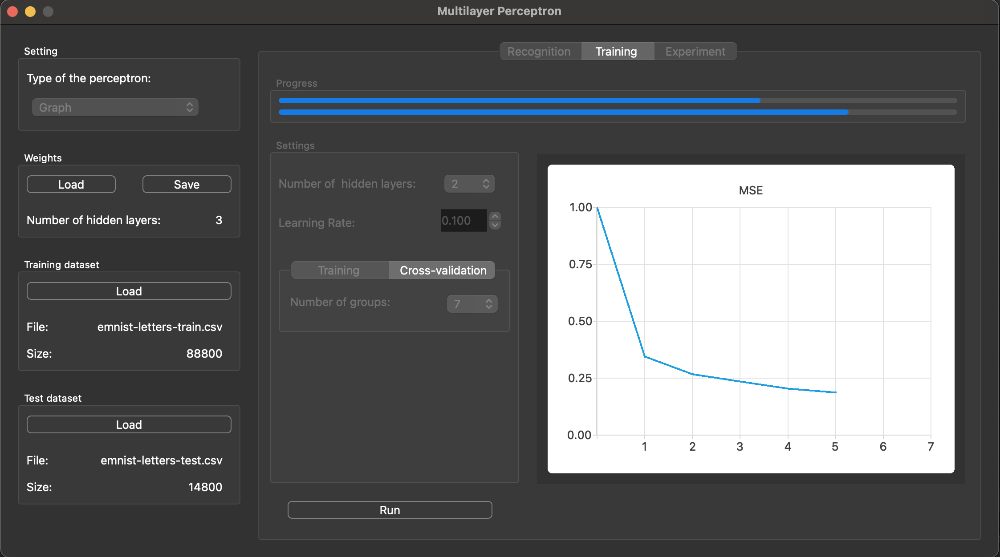
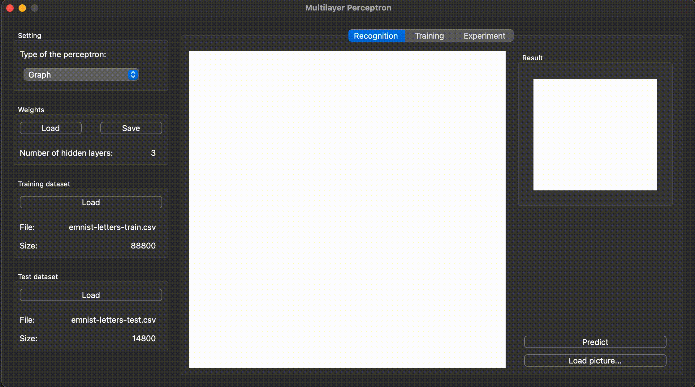

# Multilayer Perceptron v1.0
The Multilayer Perceptron project is a C++ desktop application that implements an artificial neural network for recognizing handwritten letters of the Latin alphabet (A-Z). The system provides a Qt6-based graphical interface that allows users to train neural networks, test their performance, and classify handwritten letters from images or hand-drawn input. The application demonstrates two distinct implementation approaches—matrix-based and graph-based—for constructing and executing multilayer perceptrons, enabling users to compare performance and architectural trade-offs.
[](https://deepwiki.com/IgorBio/Multilayer_Perceptron)
#### Program launch options

```
make run
```

## Features
- GUI implementation, based on QT6

  

- Load train and test datasets from a csv file.
- Choose the network topology with 2-5 hidden layers.
- Training with using the backpropagation method and sigmoid activation.
- Matrix form: all layers are represented as weight matrices.
- Graph form: each neuron is represented as some node object connected to other nodes by refs.
- Perform experiments on a selected portion of the test sample, defined by a floating-point number ranging from 0 to 1.
- Load BMP images (image size can be up to 512x512) with Latin letters and classify them.
- Draw two-color square images by hand and classify them.
- Real-time training process for a user-defined number of epochs with displaying the error values for each training epoch.
- Run the training process using cross-validation for a given number of groups k.
- Save to a file and load weights of perceptron from a file.

  

## License
Copyright (c). All rights reserved.
